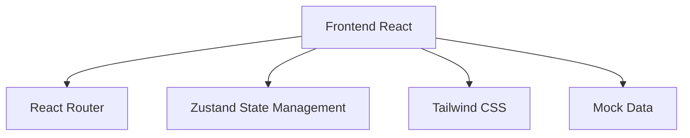

## 1. Architecture Design



## 2. Technology Description

- Frontend: React@18 + TypeScript + tailwindcss@3 + vite
- Initialization Tool: vite-init
- Backend: None (纯前端项目)
- Database: None (使用本地状态管理和模拟数据)
- State Management: Zustand
- Routing: React Router DOM

## 3. Route Definitions

| Route | Purpose |
|-------|---------|
| / | 首页，展示所有商品 |
| /product/:id | 商品详情页 |
| /category/:category | 分类浏览页 |
| /cart | 购物车页 |

## 4. Data Model

### 4.1 Product Data Definition

```typescript
interface Product {
  id: string;
  title: string;
  author: string;
  description: string;
  price: number;
  category: string;
  tags: string[];
  image: string;
  screenshots: string[];
  stars: number;
  downloads: number;
}
```

### 4.2 Cart Item Data Definition

```typescript
interface CartItem {
  product: Product;
  quantity: number;
}
```

### 4.3 Sample Data

```typescript
const products: Product[] = [
  {
    id: '1',
    title: 'GitHub Actions Pro',
    author: 'GitHub',
    description: '增强你的 CI/CD 工作流',
    price: 29.99,
    category: 'tools',
    tags: ['CI/CD', 'Automation'],
    image: 'https://images.unsplash.com/photo-1618401471353-b98afee0b2eb?w=800&h=600&fit=crop',
    screenshots: [
      'https://images.unsplash.com/photo-1618401471353-b98afee0b2eb?w=800&h=600&fit=crop',
      'https://images.unsplash.com/photo-1555066931-4365d14bab8c?w=800&h=600&fit=crop'
    ],
    stars: 4.8,
    downloads: 15000
  },
  {
    id: '2',
    title: 'Code Review Assistant',
    author: 'DevTools',
    description: '智能代码审查工具',
    price: 19.99,
    category: 'plugins',
    tags: ['Code Review', 'AI'],
    image: 'https://images.unsplash.com/photo-1498050108023-c5249f4df085?w=800&h=600&fit=crop',
    screenshots: [
      'https://images.unsplash.com/photo-1498050108023-c5249f4df085?w=800&h=600&fit=crop'
    ],
    stars: 4.6,
    downloads: 8000
  },
  {
    id: '3',
    title: 'Git History Visualizer',
    author: 'VisualGit',
    description: '美观的 Git 历史可视化',
    price: 9.99,
    category: 'tools',
    tags: ['Git', 'Visualization'],
    image: 'https://images.unsplash.com/photo-1516116216624-53e697fedbea?w=800&h=600&fit=crop',
    screenshots: [
      'https://images.unsplash.com/photo-1516116216624-53e697fedbea?w=800&h=600&fit=crop'
    ],
    stars: 4.7,
    downloads: 12000
  }
];
```

