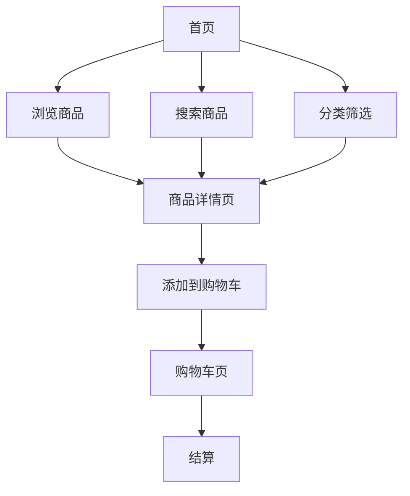

## 1. Product Overview

GitHub商店是一个模拟GitHub应用市场的Web应用，展示和销售GitHub相关的工具、插件和应用程序，为开发者提供发现和获取优质GitHub工具的平台。

## 2. Core Features

### 2.1 User Roles

| Role | Registration Method | Core Permissions |
|------|---------------------|------------------|
| 普通用户 | 无需登录 | 浏览商品、搜索、筛选 |

### 2.2 Feature Module

1. **首页**: 导航栏、精选商品展示、商品分类、搜索功能
2. **商品详情页**: 商品信息展示、价格、描述、截图、相关推荐
3. **分类浏览页**: 按分类展示商品、筛选排序
4. **购物车页**: 商品添加删除、数量调整、结算

### 2.3 Page Details

| Page Name | Module Name | Feature description |
|-----------|-------------|---------------------|
| 首页 | 导航栏 | Logo、搜索框、购物车图标、分类菜单 |
| 首页 | 精选商品 | 轮播展示热门商品 |
| 首页 | 商品网格 | 展示所有商品卡片 |
| 首页 | 分类筛选 | 按分类筛选商品 |
| 商品详情页 | 商品信息 | 标题、作者、价格、描述、标签 |
| 商品详情页 | 商品截图 | 图片轮播展示 |
| 商品详情页 | 添加购物车 | 一键添加购物车按钮 |
| 分类浏览页 | 分类列表 | 展示所有分类 |
| 分类浏览页 | 商品列表 | 展示该分类下的所有商品 |
| 购物车页 | 购物车列表 | 展示已添加商品 |
| 购物车页 | 数量调整 | 增减商品数量 |
| 购物车页 | 结算 | 显示总价 |

## 3. Core Process

用户访问首页 → 浏览或搜索商品 → 查看商品详情 → 添加到购物车 → 查看购物车 → 结算

## 4. User Interface Design

### 4.1 Design Style

- 主色调：GitHub深色主题 (#0d1117)
- 辅助色：绿色 (#238636)
- 按钮：圆角按钮，带有悬停效果
- 字体：Inter 字体族
- 布局：卡片式布局，响应式设计
- 图标：GitHub风格图标

### 4.2 Page Design Overview

| Page Name | Module Name | UI Elements |
|-----------|-------------|-------------|
| 首页 | 导航栏 | 深色背景，白色文字，简洁布局 |
| 首页 | 商品卡片 | 卡片式布局，包含图片、标题、价格 |
| 首页 | 分类标签 | 圆角标签，悬停变色 |
| 商品详情页 | 商品展示 | 大图展示，信息清晰 |
| 购物车页 | 购物车列表 | 简洁的列表展示 |

### 4.3 Responsiveness

桌面优先，移动端适配，触控优化

